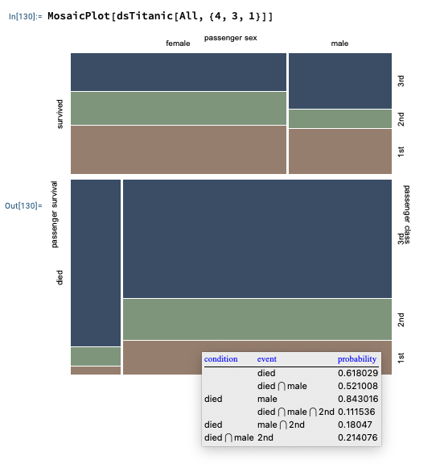

# MosaicPlot WL paclet

Wolfram Language (aka Mathematica) paclet for mosaic plots over datasets or lists of records.

The [paclet](https://resources.wolframcloud.com/PacletRepository/resources/AntonAntonov/MosaicPlot/) 
provides the function MosaicPlot that summarizes the conditional probabilities 
of co-occurrence of categorical values in a Dataset object or a list of records of the same length.

- If a list of records is given to MosaicPlot then the list is assumed to be a full array and the columns to represent categorical values.

- Note, that if a column is numerical, but has a small number of different values then it can be seen as categorical.

- This paclet is based in the paclet 
["AntonAntonov/TriesWithFrequencies"](https://resources.wolframcloud.com/PacletRepository/resources/AntonAntonov/TriesWithFrequencies/).

Here is example code:

```mathematica
dsTitanic = ResourceFunction["ExampleDataset"][{"MachineLearning", "Titanic"}];
dsTitanic[1 ;; -1 ;; 300]

MosaicPlot[dsTitanic[All, {4, 3, 1}]]
```



------- 

## Reference

### Articles

[AA1] Anton Antonov,
["Mosaic plots for data visualization"](https://mathematicaforprediction.wordpress.com/2014/03/17/mosaic-plots-for-data-visualization/),
(2014),
[MathematicaForPrediction at WordPres](https://mathematicaforprediction.wordpress.com/).

[AA2] Anton Antonov,
["Enhancements of MosaicPlot"](https://mathematicaforprediction.wordpress.com/2014/03/24/enhancements-of-mosaicplot/),
(2014),
[MathematicaForPrediction at WordPres](https://mathematicaforprediction.wordpress.com/).

### Packages, paclets

[AAp1] Anton Antonov,
[TriesWithFrequencies WL paclet](https://resources.wolframcloud.com/PacletRepository/resources/AntonAntonov/TriesWithFrequencies/),
(2023),
[Wolfram Language Paclet Repository](https://resources.wolframcloud.com/PacletRepository/).

[AAp2] Anton Antonov,
[TriesWithFrequencies Mathematica package](https://github.com/antononcube/MathematicaForPrediction/blob/master/MosaicPlot.m),
(2014-2018),
[MathematicaForPrediction at GitHub](https://github.com/antononcube/MathematicaForPrediction).